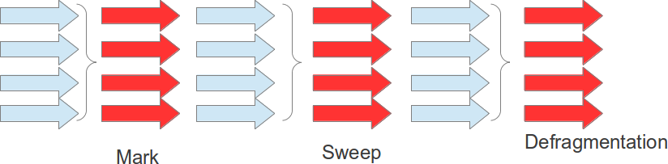

#### Implementação Paralelo

Trabalha de forma semelhante da serial, no entanto, será utilizado duas ou mais `Threads` por coleção, assim o processo tende a ser realizar em um tempo menor, porém utilizando mais recursos de máquina.

