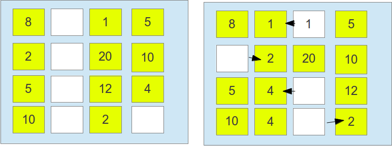

#### Implementação Garbage First
	

Lançado na versão 7 do Java, o **Garbage first**, é coletor paralelo projetada para ter um grande throughput, ele foi projetado para sistemas com uma alta quantidade de memória e de processadores. Para alcançar seu objetivo ele divide igualmente o tamanho do **Heap**. Assim como os dois últimos concorrentes, ele possui uma fase em que realiza a marcação concorrente, e realiza o calculo de objetos alcançáveis de cada região, assim de tempos em tempos, todos os processos são parados os objetos vivos são copiados para outra região, fazendo com que a região em questão seja totalmente tomada. Terão maior prioridade as regiões com o maior número de objetos “mortos” (assim se terá menos trabalho em realizar a copia para a outra área). O **G1** veio para substituir os tipos concorrente de coleção (`CMS` e `I-CMS`) devido a lacuna que ambos deixavam.

Não ter um tempo determinado para deixar o processador e a compactação do heap (uma vez que muito crítica chamada o serialOdl). O **G1** toma como estratégia o fato de ser mais fácil controlar pequenas regiões do que uma geração, um outro aspecto é que tão logo as memórias existentes tenha sido copiado para uma nova área, a anterior é considerada uma área limpa.

