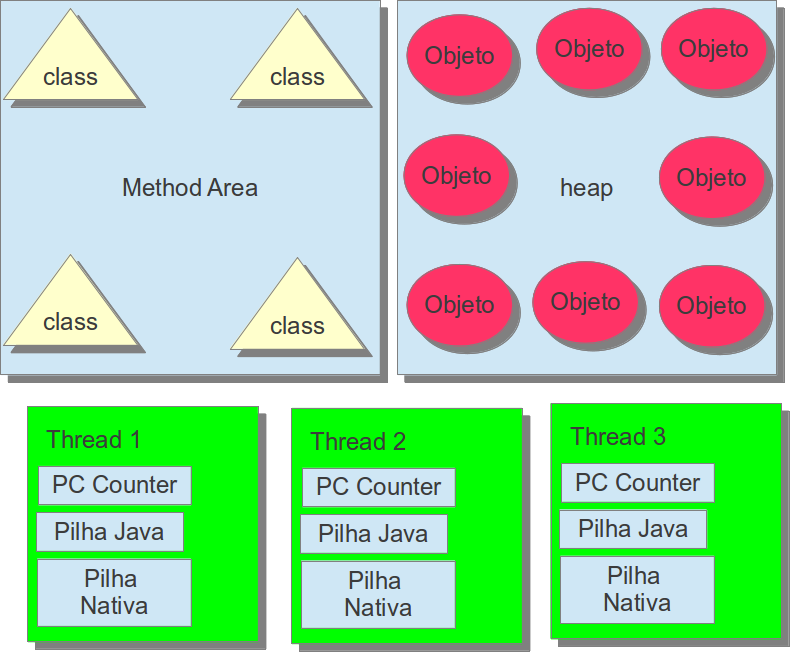

## Registradores de la JVM

Hablando un poco sobre los tipos de datos que son almacenados en la JVM y su tamaño. Es necesario tambien que se tenga el concepto de donde son almacenados tales informaciones. La JVM usa registros para almacenar varias cosas siendo que para todo tipo de dato existe un lugar específico. Durante la ejecución de un programa existen registros que son compartidos entre toda la JVM y otros que tiene la visibilidad del `Thread` actual.

