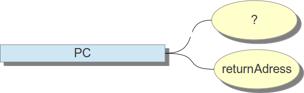

### Program Counter

O registrador **PC**, Program counter, é criado tão logo uma `Thread` é criada, ou seja, cada `Thread` possui o seu. Ele pode armazenar dois tipos de dados: 

1. 
Ponteiros nativos
1. 
returnAdress

Esses dados possuem informações quanto a instrução que está sendo executada pela `Thread`. Se o método executado for nativo o **PC** será um ponteiro e não tem o seu valor definido, do contrário, ele terá o endereço de instrução, o **returnAdress**.

