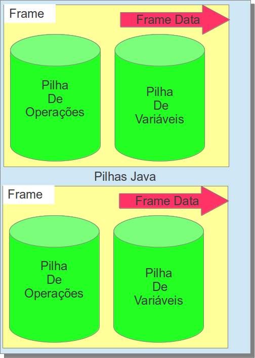

#### Stack Frame

Un **frame** es una unidad de **Java Stack** este es creado tan pronto un metodo es creado y es destruido cuando el metodo es cerrado (normalmente o interrumpido por una excepción). Cada **frame** posee una lista de las variables locales, pila de operaciones ademas de referencia de la clase actual y del metodo actual. Este frame es dividido en tres partes:

1. 
Stack variables
1. 
Stack Operand
1. 
Frame Data

