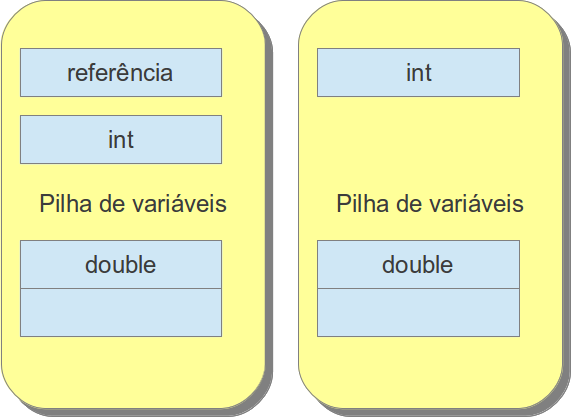

##### Stack variables

Cada **frame** contiene un vector para almacenar variables locales y parametros y ese tamaño es definido en tiempo de ejecución. en ese vector las variables `double` y `long` ocupan dos elementos del vector y son almacenados consecuentemente. Variables de tipo `int` y `returnAdress` ocupan un elemento de ese vector (`byte`, `short` y `char` son convertidos para `int`). Si el metodo es de instancia, no sea estático, el primero elemento de ese vector será ocupado por la instancia que está ejecutando ese metodo y enseguida los parametros, en el orden que fueron pasados. Si el método sea de la clase, el método sea estático, no habrá referencia de la  instancia que llama al método, asi el primer elemento serán los parametros.

