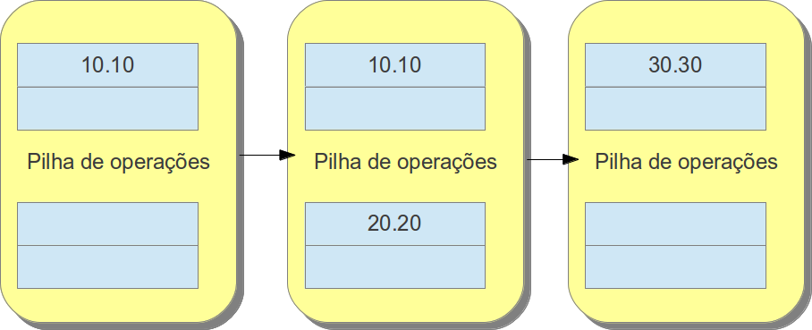
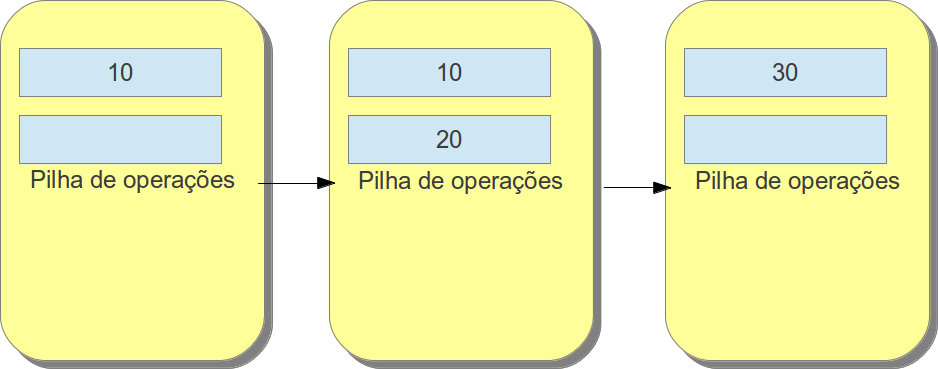

##### Stack Operand

Como el nombre indica, este registrador sirve para almacenar las instrucciones que ocurren dentro del metodo, como el registrador de variables locales los valores son almacenados en un vector pero sus valores recuperados por la eliminación del ultimo elemento del vector en vez de ser por el indice. Este es basado en la estructura de datos de la pila (Primero en entrar último en salir). El tamaño de las variables suceden de manera semejante a las variables locales.

Pila de operación, semejante a su “hermano”, su unidad posee un tamaño de 32 bits, su paso-a-paso sigue lo mismo de una pila convencional, el ultimo que entrar será el primero en salir. En este ejemplo será utilizado la suma de dos interos ( `10` y `20`).

Como la pila de operación está compuesta por unidades de 32 bits, si fuera `double` o `long` este ocupará las dos unidades seguidas, en este ejemplo son sumados dos doubles ( `10.10` e `20.20`)