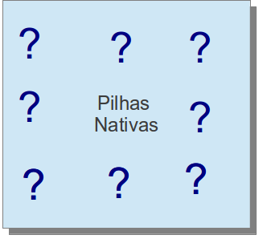

### Native Method Stacks

Tiene la finalidad de almacenar variables y valores nativos (métodos escritos en otros lenguajes), es creado tan pronto un `Thread` es iniciado y todos los `Threads` poseen su registrador.

