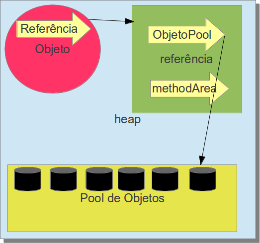

#### Heap Space

Tan pronto una instancia es creada, las informaciones de su objeto quedan almacenadas aqui, ese espacio de memoria tambien es compartido entre los `Threads`. El **heap** tiene su mecanismo de reclamar memoria en tiempo de ejecución ademas de mover objetos evitando la fragmentación del espacio.

Representación de una variable de tipo de referencia dentro del **Heap** es diferente de los tipos primitivos, este tiene su mecanismo muy semejante a los punteros de `C/C++` ya que este no tiene la información, solo apunta para el lugar donde lo tiene. El objeto de referencia es constituido de dos punteros menores:

* Uno apuntará para el pool de objetos, lugar donde estan las informaciones.
* El segundo apuntará para su constant pool (que tiene las informaciones de la clase como los atributos, metodos, encapsulamientos, etc.) que queda localizado en el **method Area**.

La representación de los vectores se comporta de forma semejante las variables de referencia, pero estos ganan dos campos a mas: 

1. 
O **tamaño**, que define el tamaño del vector
1. 
Una **lista de referencia** que apuntan para los objetos que están dentro de ese vector. 

