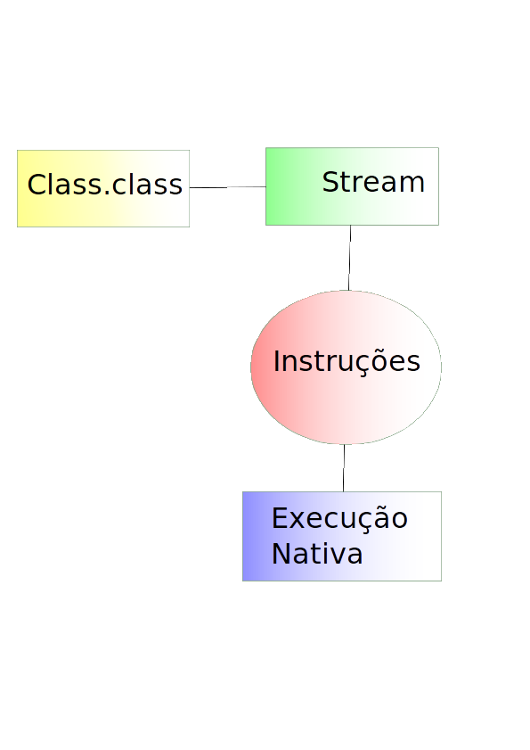

### Ciclo de vida de una clase

Toda clase por la JVM tiene su ciclo de vida, y comienza cuando esta nace dentro de la JVM, este proceso es hecho de modo lazy, es decir, la clase X será cargada en el momento en que fuera necesario, al instanciar un objeto es hecho el proceso de encontrar la representación binária de la clase, cargar las informaciones y colocar en su clase dentro de la JVM, entonces crea el objeto. Todas las clases necesitan pasar por ese proceso inclusive la clase que inicia la JVM. En caso la clase herede de una clase o implemente interfaces las mismas tendrán que ser cargadas primero. Como cada uno de esos procesos tienen detalles, se excluirán las acciones de cada uno.	

La carga de clase consiste en subir la clase para la memoria principal y colocar en la JVM, este proceso sucede una vez con **qualifield**, con ese stream cargado se realiza el parser para el registrador **method Area** y terminando este genera la interface que representa tal archivo, o `java.lang.Class`. 	

La interface `Class` es el produto del proceso de cargar la clase para la memoria principal, es la representación del archivo, con eso este contiene las informaciones del mismo, como lista de los métodos, atributos, interfaces, anotaciones, etc.

Las clases por su vez, son cargadas por el `ClassLoader` (con excepción de los array que no tienen representación binária).

En la JVM existen multiples clases loaders con diferentes reglas, asi podemos clasificarlas como: 

* **BootStrap** este se encuentra en la cima de la jerarquia de los class loaders, este objeto es responsable de cargar la API basica de Java, y los objetos que posean un altísimo nível de confianza por la JVM. 
* **Extensión** es responsable por cargar las API standard de Java como las de seguridad y Collection. 
* El **system** este es el class loader standard de la aplicación, este es responsable por cargar las clases que estan contenidas en el classpath. 
* Abajo de System Class Loader el usuario adicionará un class loader, que tiene algunos motivos especiales, entre ellos definir un grupo de class loader específico para un dominio o aplicación, es el caso de los servidores de aplicación como tomcat y Glassfish.
 

Despues que la clase sea cargada el próximo paso será linkear para la JVM, este proceso consiste en la verificación de la clase recien cargada, este verifica la palabra-clave, si la estructura está correcta, el tamaño de los archivos, despues de la verificación son asignadas en la memoria para los atributos y seran seteados los valores por default de los campos, son cargados los atributos estáticos, cerrando este proceso todos los link de referencia son sustituidos por links directos.

En la ultima fase será creada la instancia con la llamada al método constructor, siendo que antes es llamado el constructor de la superclase, no existe verificación para las interfaces solo si los metodos fueron implementados.

