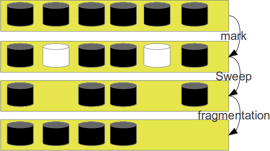
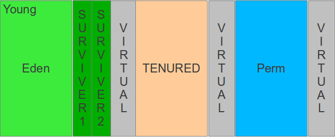

### Garbage Collector

Diferente de algunos lenguajes Java tiene una gestión de memoria automática, eso permite que la memoria de un objeto no mas utilizado sea retomada, eso ciertamente es una de las grandes ventajas de la plataforma en relación a `C`. El primer desafio de la JVM es identificar cuales objetos son dispensables, y asi retomar la memoria con eso fue realizada varias técnicas para asi hacerlo.

El mas conocido es el **Mark and Sweep**, basicamente dos procesos que marca los objetos utilizados y en el final los objetos no marcados son dispensables para retomar la memoria, el mayor problema es que todos los procesos son parados para ejecutar tal procedimento inviabilizando llamarlo constantemente. En función de ese problema citado anteriormente hablaremos del segundo algoritmo, que lleva en consideración que muchos objetos no tiene una larga vida, no obstante, algunos llevan bastante tempo en la memoria, asi los algoritmos se basa en generaciones que divide la memoria en tres partes (joven, efectiva y permanente).

Para mejor gestionar el colector de basura la memoria heap es dividida basicamente en algunas partes:

* **Young Generation**: Es donde contienen los objetos recien creados, la grande mayoria de los objetos mueren dentro de esa area. Esta es subdividida en dos partes: **Eden** (lugar donde los objetos nacen) y **Survivers(N)** lugares donde los objetos van pasando hasta salir de Young Generation. Su funcionamento es de manera simple: Los objetos nacen en **Eden**, despues de un tiempo, los objetos son copiados “vivos” para los **Survivers**, los objetos que no fueron copiados no son borrados, pero en el futuro, otros objetos ocuparan su espacio. 
* Con el pasar de las colecciones los objetos existentes salen de la **Young** y van para **Tenured generation**, en ese espacio la gestión de objetos es realizado de forma diferente, asi no hay copia, existen algoritmos derivados de **Swep and Mark**, con los objetos borrados la próxima preocupación será en relación a la fragmentación del registrador, asi habrá el proceso de compactación de los datos.

 
Comentando un poco sobre los procesos de **menor colector** (procedimiento de generation que copia objetos para registradores sobreviventes) y el **mayor colector** (procedimiento cuyo algoritmos son derivados de **Mark and Swep** que borra los objetos no utilizados y cuando está fragmentada la memoria sucederá el procedimiento de compactación, cabe recordar que para tal procedimiento la JVM es para todos sus procesos). El objetivo ahora será hablar sobre el estilo o el modo de los Garbage Collector.
