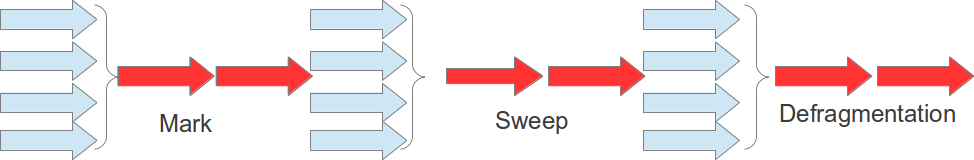

#### Implementación Serial

Este estilo es muy indicado para pequeñas aplicaciones o hardware de pequeño poder computacional y solo un processador, monocore, este se basa en la ejecución de los procesos, mayor y menor colector, utilizando solo un `Thread`, de ese modo puede economizar recursos, pero si hay un gran número de memoria habrá un gran delay. 

