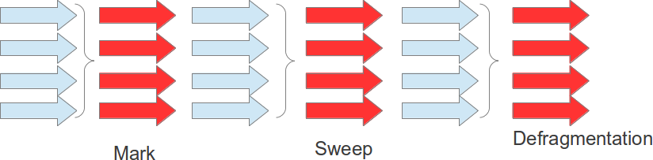

#### Implementación Paralelo

Trabaja de forma semejante de serial, no obstante, será utilizado dos o mas `Threads` por colección, asi el proceso tiende a realizarse en un tiempo menor, asi utiliza mas recursos de maquina.

