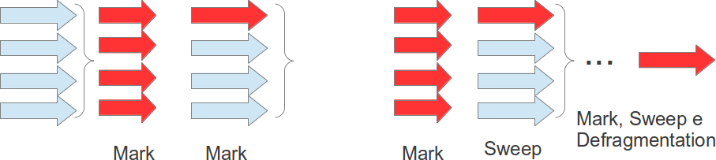

#### Implementación Concurrente

Este tambien ejecuta procesos en paralelo, no obstante, su objetivo es disminuir el tiempo de mayor colector, incluso si lo ejecuta varias veces. Conveniente para muchos objetos que duran mucho tiempo, asi estos quedan en **Turnered**. Resumiendo sus divisiones de proceso realizan marcación en que todas las `Thread` estan paradas y marcaciones concurrentes, pero la eliminación de los objetos ocurren sin detener ningun proceso, el único problema de ese estilo es el hecho que no hay compactación de datos periodico, solo cuando se vuelva crítico (usando **SerialOdl**).

