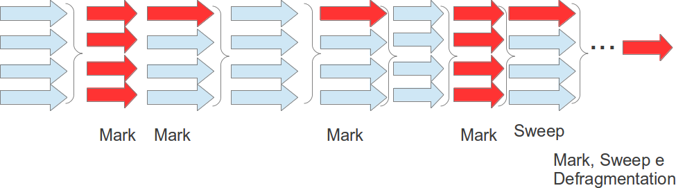

#### Implementación Incremental Concurrent

Tambien es concurrente, pero es realizado de forma incremental (realizado a pocos y agendado entre los menor-colector) su funcionamiento es bien semejante al anterior, pero adiciona un proceso que es redimensionar y preparar los datos para una proxima colección o ciclo que controla el tiempo que el colector queda en el procesador. En caso tenga problemas de fragmentación, este tambien accionará el serialOdl (que ademas de remover los datos tambien compactará los objetos sobreviventes).

