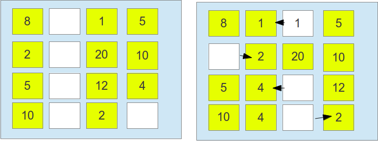

#### Implementación Garbage First
	

Lanzado en la versión 7 de Java, el **Garbage first**, es colector paralelo diseñado para tener un gran throughput, este fue diseñado para sistemas con una alta cantidad de memoria y de procesadores. Para alcanzar su objetivo este divide igualmente el tamaño del **Heap**. Asi como los dos ultimos concurrentes, este tiene una fase en que realiza la marcación concurrente, y realiza el calculo de objetos alcanzables de cada región, por lo que de vez en cuando, todos los procesos son parados los objetos vivos son copiados para otra región, haciendo que la región en cuestión sea totalmente tomada. Tendran mayor prioridad las regiones con mayor numero de objetos “muertos” (asi se tendrá menos trabajo en realizar la copia para otra area). El **G1** vino para sustituir los tipos concurrente de colección (`CMS` y `I-CMS`) debido a la brecha que ambos dejaban.

No tiene un tiempo determinado para dejar el procesador y la compactación del heap (muy critica la llamada serialOdl). El **G1** toma como estrategia el hecho de ser mas facil controlar pequeñas regiones de que una generación, otro aspecto es que tan pronto las memorias existentes haya sido copiado para una nueva area, la anterior es considerada una area limpia.

