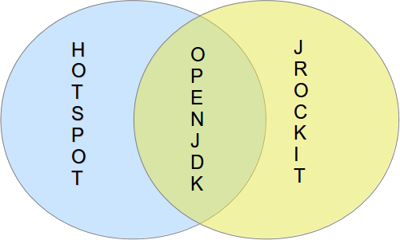

### El proyecto OpenJDK

El OpenJDK es un proyecto que fue iniciado por Sun Microsystems, actualmente mantenido por varias empresas y la comunidad, para la creación de un Java Development Kit basado totalmente en software livre y de código abierto. El proyeto fue iniciado en 2006 y tiene como base HotSpot (a jvm da Sun).	Una conquista para el proyecto que vale resaltar es que a partir de la versión 7 de Java OpenJDK es la versión de referencia, pero ademas de eso el uso de OpenJDK te garantiza algunas ventajas:

1. 
La primera ventaja es que este es open source, osea, puede estudiar su codigo fuente.

1. 
Esta ahora esta la implementación de referencia, osea, si haces un aplicativo que corra en cualquier JVM, esta garantia será posible solo con OpenJDK

1. 
La comunidad Java es ciertamente una de las comunidades mas fuertes del mundo. La JVM del proyecto, por ejemplo, está pasando por constantes refactorizaciones para mejorias de performance, actualización de bibliotecas y atualización de código sin mencionar que para adicionar cualquier recurso es necesario que se haga pruebas.

1. 
Oracle donó el codigo fuente de jRockit en java 8, previsto para el final de 2013, asi el código sea integrado con Hotspot. Osea, en openjdk habrá los mejores de dos mundo en un solo lugar.

1. 
Varias empresas forman parte de este proyecto, ose, es una JVM con Know-how de varias empresas en todo el mundo. Empresas como IBM, Apple, SAP, Mac, Azul, Intel, RedHat etc. forman parte del proyecto.

1. 
Si Oracle deja Java (Algo que creo muy dificil por diversos motivos) y dejar de hacer la JVM. OpenJDK no será en ningun momento avalado ya que existen otras empresas apoyando ademas de la comunidad.

La diferencia entre las dos JVMs, **HotSpot** (la JVM mas popular de Sun actualmente de Oracle) y el **OpenJDK**, está en la adición de codigos terminados ademas de cambios en la implementación para implementaciones cerradas para la JVM de Oracle, la diferencia es de cerca del `4%` del código completo. Lo que sucede es que no todos los codigos fueron abiertos con exito ya que algunos pertenecen a terceros y solo son licenciados en la epoca por Sun.

Todo cambio dentro de Java es realizado através de los postulados de una **JSR**, Java Specification Requests, que es un documento que tienes informaciones en cuanto a la mejora a ser hecha y sus impactos dentro del lenguaje. Esas JSRs son seleccionadas a partir de **JCP**, Java Community Process, que es compuesta por 31 instituciones (Podemos destacar la participación da Oracle, SouJava y London Comunity). Estas instituciones tienen la misión de votar a favor o en contra de una JSR. Cuando existe un cambio en la plataforma (JSE, JEE, JME) es dicho que esta tiene un respaldo de especificaciones (Ya que un cambio de plataforma es resultado de diversos JSRs, por ejemplo con Java 7, documentado en la JSR 336, tiene dentro de esta las JSRs 314 el proyecto Coin, 203 o NIO2, 292 o invoke dynamic). 

Como OpenJDK no es diferente, todos los cambios necesitan estar documentados en  JSRs que son votados por el JCP, en caso de una nueva versión de la plataforma JSE, necesita tener un conjunto de JSR o un respaldo de especificación. No obstante, para mejorias, refactorizaciones existe **JEP**, JDK Enhancement Proposals o propuestas de mejoria para JDK.

El código del proyecto es mantenido en mercurial y mas informaciones del proyecto puede ser encontrado en: [http://openjdk.java.net/](http://openjdk.java.net/)

Para bajar el codigo es necesario:

* `hg clone http://hg.openjdk.java.net/jdk8/jdk8 jdk8` (para bajar el codigo fuente en su maquina).

* `cd jdk8` (entrando al directorio, donde se encuenta el codigo fuente).

* `sh get_source.sh` (shell script para bajar el código fuente de los módulos de la JVM).
 
Al bajar el codigo verá que el proyecto OpenJDK esta compuesto por subproyectos:

