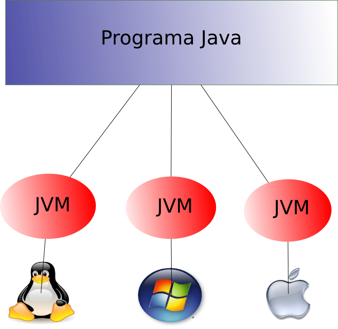

## Funcionamento básico da JVM

Este capítulo falará um pouco sobre o funcionamento básico da JVM, que é o coração da linguagem java. Esta é responsável pela independência entre as plataformas e roda basicamente dois tipos de processos: 

* Os escrito em java que são gerados **bytecodes** 
* Os nativos que são escritas em linguagens como o C\C++ e *linkadas* dinamicamente para uma plataforma específica.

Os métodos nativos são muito interessantes para obter informações do SO onde a JVM está em execução, além de utilizar recursos deste. E é em função disso que apesar de a linguagem ser **RunAnyWhere** a JVM não é, ou seja, para cada plataforma existe uma máquina virtual específica. Isso acontece, por exemplo, para usar recursos específicos da plataforma onde, por exemplo, existem chamadas distintas para trabalhar com diretório e arquivos.

O único e principal motivo da JVM é rodar o aplicativo. Quando se inicia uma execução a JVM nasce e quando a aplicação termina ela morre. É criado uma JVM para cada aplicação, ou seja, se executar três vezes o mesmo código em uma mesma máquina serão iniciadas 3 JVMs. Para rodar uma aplicação basta que sua classe possua um método público e estático com o nome main e tenha como parâmetro um vetor de `String`.

Ao iniciar uma JVM existem alguns processos que rodam em paralelos e em backgrouns e executam diversas operações e processos para manter a JVM sempre disponível: 

* Os Timers que são responsáveis pelos eventos que acontecem periodicamente, por exemplo, interrupções, eles são usados para organizar os processos que acontecem continuamente. 
* Os processos do Garbage Collector que é responsável por executar as atividades do coletor de lixo da JVM.
* Compiladores que são responsáveis por transformar bytecode em código nativo.
* Os ouvintes, que recebem sinais (informações) e tem como principal objetivo enviar essas informações para o processo correto dentro da JVM.
 

Falando um pouco mais sobre esses processos paralelos ou `Thread`, a JVM permite que múltiplos processos executem concorrentemente, essa rotina em Java está diretamente relacionada com uma `Thread` nativa. Tão logo um processo paralelo em Java nasça, os seus primeiros passos são:

* Alocação de memória
* Sincronização dos objetos
* Criação dos registradores específicos para a mesma e a alocação da `Thread` nativa. 
 
Quando essa rotina gera uma exceção a parte nativa envia essa informação para a JVM que a encerra. Quando a `Thread` termina todos os recursos específicos, tanto para o Java quanto para a parte nativa, são entregues para a JVM.

Como na linguagem, a JVM opera em dois tipos de dados: 

1. 
Os primitivos
1. 
Os valores de referência. 

A JVM espera que toda a verificação quanto ao tipo tenha sido feito no momento da execução, sendo que os tipos primitivos não precisão de tal verificação ou inspeção já que eles operam com um tipo específico de instrução (por exemplo: iadd, ladd, fadd, e dadd para inteiro, long, float e double respectivamente).

A JVM tem suporte para objetos que são ou instância de uma classe alocada dinamicamente ou um array, esses valores são do tipo **reference** e o seu funcionamento é semelhante ao de linguagens como C/C++.

Os tipos primitivos existentes na JVM são: 

* Numéricos
* Booleano 
* returnAdress

Sendo que os tipos numéricos são os valores inteiros e flutuantes.

|Nome|Tamanho|variação|Valor padrão|Tipo|
| -- | -- | -- | -- | -- |
|byte|8-bit|-2⁷  até 2⁷|0|inteiro|
|short|16-bits|-2¹⁵ até  2¹⁵|0|inteiro|
|integer|32-bits|-2³² até 2³¹|0|inteiro|
|long|64-bits|-2⁶³ até 2⁶³|0|inteiro|
|char|16-bits|UFT-8|'\u0000'|inteiro|
|float|32-bits||0|flutuante|
|double|64-bits||0|flutuante|
|boolean|inteiro||false|booleano|
|returnAddress|||nulo|ponteiro|

Os formatos de ponto flutuante são o `float`, com precisão simples, e o `double`, com dupla precisão. Tantos os valores como as operações seguem o especificado no padrão IEEE para aritmética de ponto flutuante binário (ANSI/ IEEE. 754-1985, Nova York). Esse padrão não inclui apenas valores positivos e negativos, mas zero, positivo e negativo infinito e não um número (abreviado como **Nan** é utilizado para representar valores inválidos como divisão por zero). Por padrão, as JVM suportam esse formato, mas também podem suportar versões estendidas de `double` e `float`.

O **returnAdress** é usado apenas pela JVM, não possui representação na linguagem, tem seu funcionamento similar a ponteiros e diferentes dos tipos primitivos não podem ser modificados em tempo de execução.

Na JVM o tipo booleano possui um suporte bem limitado, não existem instruções para booleano, na verdade eles são compilados para usar os tipos de instruções do `int` e o array de booleano são manipulados como `array` de `byte`. Os valores são representados com `1` para verdadeiro e `0` para falso.

Falando um pouco sobre o tipo de referência, existem três tipos: 

1. 
classes
1. 
array
1. 
interfaces

O Valor de referência é iniciado como `null`, o nulo não é um tipo definido, mas pode ser feito cast para qualquer tipo de referência.
	
Recapitulando, existem basicamente dois tipos de dados:

* Primitivos e Referência. 
 * As referências possuem os seus subtipos: classe, interface e array.
 * Os primitivos possuem returnAdress, booleano, flutuantes (float e double de simples e dupla precisão respectivamente), inteiros (short, byte, int, long, char).