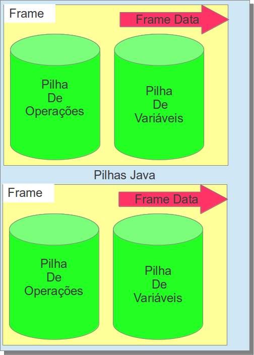

#### Stack Frame

O **frame** é a unidade do **Java Stack** ele é criado tão logo se cria um método e é destruído quando o método é encerrado (normalmente ou ininterrompido por uma exceção). Cada **frame** possui uma lista das variáveis locais, pilha de operações além da referência da classe corrente e do método corrente. Esse frame é dividido em três partes:

1. 
Stack variables
1. 
Stack Operand
1. 
Frame Data

