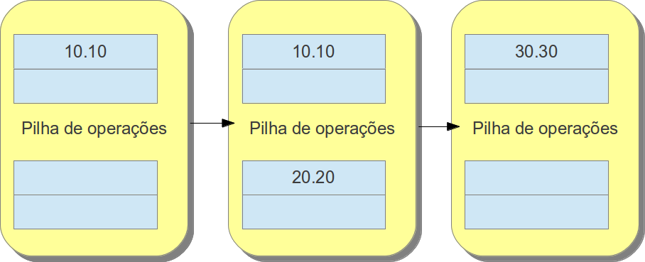

##### Stack Operand

Como o nome indica, esse registrador serve para armazenar as instruções que ocorrem dentro do método, como o registrador de variáveis locais os valores são armazenados em um vetor mas seus valores recuperados pela remoção do último elemento do vetor em vez de ser pelo índice. Ele é baseado na estrutura de dados de Pilha (Primeiro a entrar último a sair). O tamanho das variáveis acontecem de maneira semelhante as variáveis locais.

Pilha de operação, semelhante ao seu “irmão”, sua unidade possui o tamanho de 32 bits, seu passo-a-passo segue o mesmo de uma pilha convencional, o ultimo que entrar será o primeiro a sair. Nesse exemplo será utilizado a soma de dois inteiros (`10` e `20`).

Como a pilha de operação é composta por unidade de 32 bits, quando for `double` ou `long` ele ocupará as duas unidades seguidas, nesse exemplo são somados dois doubles (`10.10` e `20.20`)