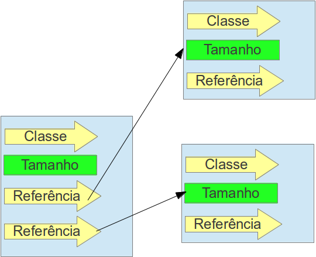

#### Heap Space

Tão logo uma instância é criada, as informações do seu objeto ficam armazenados aqui, esse espaço de memória também é compartilhado entre as `Threads`. O **heap** tem seu mecanismo de reclamar memória em tempo de execução além de mover objetos evitando a fragmentação do espaço.

Representação de uma variável do tipo de referência dentro do **Heap** é diferente dos tipos primitivos, ele tem o seu mecanismo muito semelhante aos ponteiros do `C/C++` já que ele não possui a informação, apenas aponta para o local que o possui. O objeto de referência é constituído de dois ponteiros menores:

* Um apontará para o pool de objetos, local aonde estão as informações.
* O segundo apontará para o seu constant pool (que possui as informações da classe quanto aos atributos, métodos, encapsulamentos, etc.) que fica localizado no **method Area**.

A representação dos vetores se comporta de forma semelhante as variáveis de referência, mas eles ganham dois campos a mais: 

1. 
O **tamanho**, que define o tamanho do vetor
1. 
Uma **lista de referência** que apontam para os objetos que estão dentro desse vetor. 

