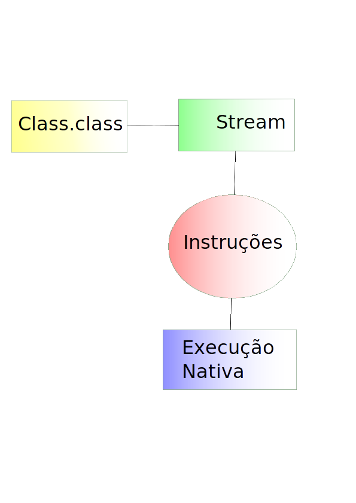
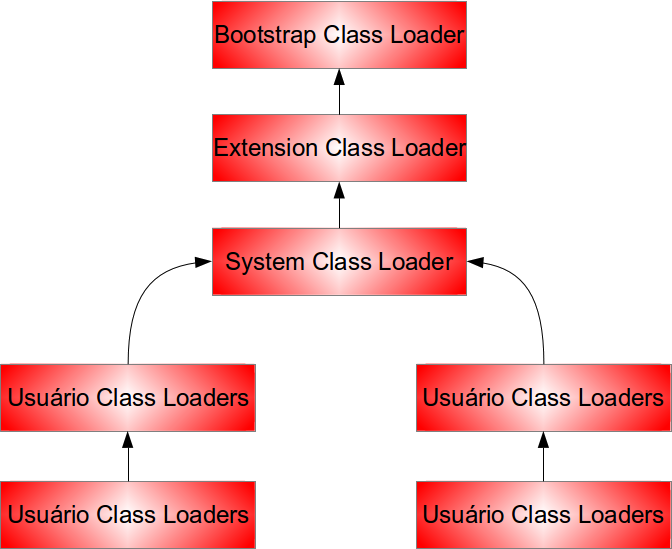

### Ciclo de vida de uma classe

Toda classe pela JVM possui o seu ciclo de vida, e começa quando ela nasce dentro da JVM, esse processo é feito de modo lazy, ou seja, a class X será carregada no momento em que for necessário, ao instanciar um objeto é feito o processo de encontrar a representação binária da classe, carregar as informações e colocar a sua classe dentro da JVM, então criar o objeto. Todas as classes precisam passar por esse processo inclusive a classe que inicia a JVM. Caso a classe estenda de uma classe ou implemente interfaces as mesmas terão de ser carregadas primeiro. Como cada um desses três processos possui detalhes, se discriminará as ações de cada um.	

O carregamento de classe consiste em subir a classe para memória principal e colocar na JVM, esse processo acontece uma vez com pot **qualifield**, com esse stream carregado se realiza o parser para o registrador **method Area** e concluindo gera a interface que representa tal arquivo, o `java.lang.Class`. 	

A interface `Class` é o produto do processo de carregar a classe para a memória principal, é a representação do arquivo, com isso ele contém as informações do mesmo, como lista dos métodos, atributos, interfaces, anotações, etc.

As Classes por sua vez, são carregadas pelo `ClassLoader` (com exceção dos array que não possui representação binária).

Na JVM existem múltiplos classe loaders com diferentes regras, assim podemos classificar-las como: 

* **BootStrap** ele se encontra no topo da hierarquia dos class loaders, esse objeto é responsável por carregar a API básica do Java, e os objetos que possuam um altíssimo nível de confiança pela JVM. 
* **Extensão** é responsável por carregar as API padrões do Java como as de segurança e Collection. 
* O **system** esse é o class loader padrão da aplicação, ele é responsável por carregar as classes que estão contidas no classpath. 
* Abaixo do System Class Loader o usuário adicionará um class loader, que tem alguns motivos especiais, entre eles definir um grupo de class loader específico para um domínio ou aplicação, é o caso dos servidores de aplacação como o tomcat e o Glassfish.
 

Após a classe ser carregada o próximo passo será linkar para JVM, esse processo consiste na verificação da classe recém-carregada, ele verifica a palavra-chave, se a estrutura está correta, o tamanho dos arquivos, após a verificação são alocadas memórias para os atributos e serão setados os valores padrão dos campos, são carregados os atributos estáticos, encerrando esse processo todos os link de referência são substituídos por links diretos.

No último estágio será a criada a instância com a chamada do método construtor, sendo que antes é chamado o construtor da superclasse, não existe verificação para as interfaces apenas se os métodos foram implementados.

