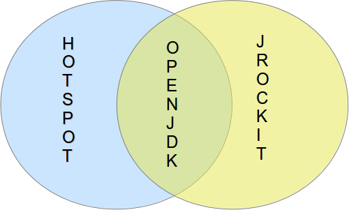

### O projeto OpenJDK

O OpenJDK é um projeto que foi iniciado pela Sun Microsystems, atualmente mantido pela por várias empresas e a comunidade, para a criação de um Java Development Kit baseado totalmente em software livre e de código aberto. O projeto foi iniciado em 2006 e tem como base o HotSpot (a jvm da Sun).	Uma conquista para o projeto que vale salientar é que a partir da versão 7 do Java o OpenJDK é a versão de referência, mas além dessa o uso do OpenJDK te garante algumas vantagens:

1. 
A primeira vantagem é que ele é open source, ou seja, pode estudar o seu código fonte.

1. 
Ela agora é a implementação de referência, ou seja, se fazer um aplicativo que rode em qualquer JVM, essa garantia será possível apenas com o OpenJDK

1. 
A comunidade Java é certamente uma das comunidades mais fortes do mundo. A JVM do projeto, por exemplo, está passando por constantes refatorações para melhoria de performance, atualização de bibliotecas e atualização do código sem falar que para adicionar qualquer recurso é necessário que se tenha testes.

1. 
A Oracle doou o código fonte do jRockit e no java 8, previsto para o final de 2013, o código seja integrado com o Hotspot. Ou seja, no openjdk haverá os melhores de dois mundos em um só lugar.

1. 
Várias empresas fazem parte desse projeto, ou seja, é uma JVM com o Know-how de várias empresas em todo o mundo. Empresas como IBM, Apple, SAP, Mac, Azul, Intel, RedHat etc. fazem parte do projeto.

1. 
Se a Oracle deixar o Java (Algo que eu acho muito difícil por diversos motivos) e deixar de fazer a JVM. O OpenJDK não será em nenhum momento abalado já que existem outras empresas apoiando além da comunidade.

A diferença entre essas duas JVMs, **HotSpot** (a JVM mais popular da Sun atualmente da Oracle) e o **OpenJDK**, está na adição de códigos fechados além de pequenas mudanças na implementação para implementações fechadas para a JVM da Oracle, a dessemelhança é de cerca de `4%` de código. O que acontece é que nem todos os códigos foram abertos com êxito já que alguns pertence a terceiros e são apenas licenciados na época pela Sun.

Toda mudança dentro do Java é realizada através da submissão de uma **JSR**, Java Specification Requests, que é um documento que possui informações quanto a melhoria a ser feita e seus impactos dentro da linguagem. Essas JSRs são selecionadas a partir do **JCP**, Java Community Process, que é composta por 31 instituições (Podemos destacar a participação da Oracle, SouJava e London Comunity). Essas instituições têm a missão de votar a favor ou contra uma JSR. Quando existe uma mudança na plataforma (JSE, JEE, JME) é dito que ela possui um guarda-chuva de especificações (Já que uma mudança de plataforma é resultado de diversas JSRs, por exemplo com o Java 7, documentada na JSR 336, possui dentro dela as JSRs 314 o projeto Coin, 203 o NIO2, 292 o invoke dynamic). 

Com o OpenJDK não é diferente, todas as suas mudanças precisam estar documentadas em JSRs que são votadas pelo JCP, no caso de uma nova versão da plataforma JSE, precisa ter um conjunto de JSR ou um guarda-chuva de especificação. No entanto, para melhorias, refatorações existe o **JEP**, JDK Enhancement Proposals ou propostas de melhorias para o JDK.

O código do projeto é mantido em mercurial e mais informações do projeto pode ser encontrado em: [http://openjdk.java.net/](http://openjdk.java.net/)

Para baixar o código é necessário:

* `hg clone http://hg.openjdk.java.net/jdk8/jdk8 jdk8` (para baixar o código fonte em sua máquina).

* `cd jdk8` (entrando no diretório, onde se encontra o código fonte).

* `sh get_source.sh` (shell script para baixar o código fonte dos módulos da JVM).
 
Ao baixar o código se verá que o projeto OpenJDK é composto por subprojetos:

